# Heart_Disease_Prediction_using_Alteryx
This project is about predicting the likelihood of a patient developing heart disease.
## Business Understanding
Heart Failure is a complex clinical syndrome characterized by the reduced ability of the heart to pump and/or fill with blood. Heart failure is a disease that is currently affecting about twenty-six million people worldwide and its prevalence is further increasing. Due to its widespread and prevalence, it is important to take preventive measures that will reduce the rate of heart failures and improve health outcomes. In order to take preventive measures, it is important to understand the factors which are known to increase the risks of heart disease, this report thus aim to further investigate the likelihood of a person having a heart disease. This will be done by analyzing a data set containing records of patients with heart disease, and examining the factors that have been closely associated with heart disease to see if there is a pattern that will help predict the probability of someone having a heart disease. The model will be deemed successful if it has an accuracy above eighty percent.
## Data Understanding and Preparation
The data for this analysis is sourced from Kaggle and it has nine hundred and eighteen (918) observations of patients. The dataset contains twelve fields in total, eleven of which are features that can be used to predict a possible heart disease. These features are:
1. Age – The age of patient in years
2. ChestPainType – The type of chest pain (TA: Typical Angina, ATA: Atypical Angina, NAP:
Non-Anginal Pain, ASY: Asymptomatic)
3. Sex – Male (M) or Female (F)
4. Cholesterol – Patient’s serum cholesterol measurement in [mg/dl]
5. Resting BP - Patient’s resting blood pressure (mm Hg)
6. RestingECG - Resting electrocardiogram results [Normal: Normal, ST: having ST-T wave abnormality (T wave inversions and/or ST elevation or depression
of > 0.05 mV), LVH: showing probable or definite left ventricular hypertrophy by Estes'criteria].  
Electrocardiogram (ECG) is used to record the electrical activity of the heart from different angles to both identify and locate pathology.  

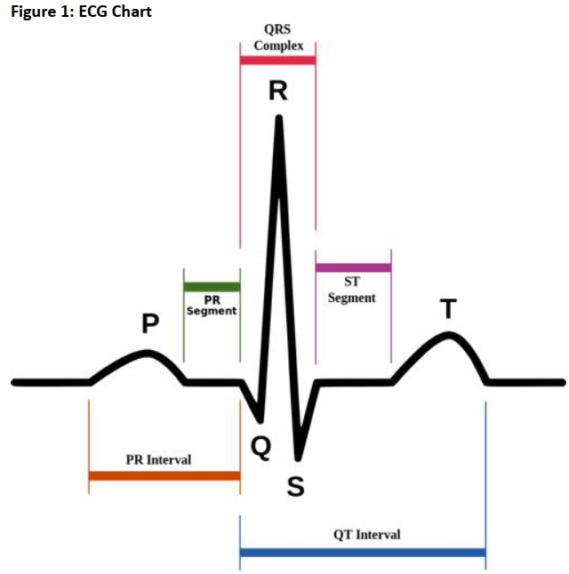  

7. FastingBS – Patient’s fasting blood sugar [1: if FastingBS > 120 mg/dl, 0: otherwise]
8. ExerciseAngina - Exercise-induced angina [Y: Yes, N: No] Angina is a type of chest pain
caused by reduced blood flow to the heart (Mayo Clinic, 2021).
9. MaxHR - Maximum heart rate achieved [Numeric value between 60 and 202]
10. Oldpeak - ST [Numeric value measured in depression]
ST depression induced by exercise relative to rest ('ST' relates to positions on the ECG
plot)
11. ST_Slope - the slope of the peak exercise ST segment [Up: upsloping, Flat: flat, Down:
down sloping]
12. HeartDisease - output class [1: heart disease, 0: Normal]
(Fedesoriano, 2021)
## Data Exploration
The data(heart.csv) is loaded into Alteryx where I will examine the integrity of the data. Alteryx showed that nine hundred and eighteen (918) records were loaded with no missing values. The next step is to use the select node to check if the features have the right data types. The data types were changed as follows: 

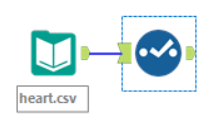  

  * Age - Integer
  * ChestPainType - Vstring
  * Sex - Vstring
  * Cholesterol - Int
  * RestingBP – Int
  * RestingECG - Vstring
  * FastingBS – Int
  * ExerciseAngina – Vstring – column contains Y or N for yes and no. This indicates true or false which is supposed to be a Boolean data type. The field will be loaded as Vstring and will be changed using the formula tool to Boolean, by denoting yes (Y) as 1 and no (N) as 0.
  * MaxHR - Int
  * Oldpeak - Double
  * HeartDisease – This is a Boolean data type, however, I will use int as this will help in measuring accuracy of prediction.
  * ST_Slope – Vstring  
The next step is connecting the field summary node to the select tool to further examine the data.  

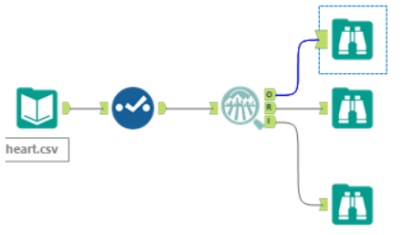  

Running the model brought up a summary table which shows the descriptive statistics of the data such as: minimum value, maximum value, mean, median, unique values, percent missing, and standard deviation across the features of the data. There was no missing data or any inconsistency in the data.  
A detailed table of the descriptive statistics of the field is shown in the table below:  

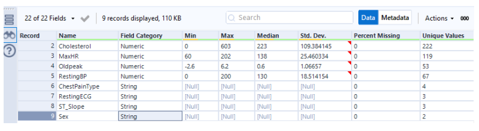  

The R node of the browser tool in the alteryx app is used to carry out visualizations which further explains the data. Further exploration of the data is also done using the interactive chart and scatter plot. These visualizations will be used to examine the variables individually in regards to their distribution and their correlation to a heart disease.  

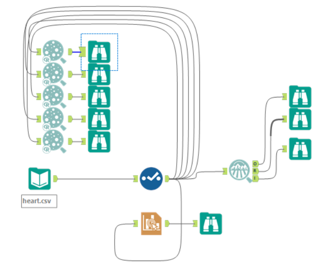  

### Heart Disease
  

In this dataset for predicting heart disease, out of the nine hundred and eighteen (918) patients, about fifty-five percent have heart disease while forty-four percent does not.
### Age
|                                  |                                       |
|:--------------------------------:|:-----------------------------------:  |
|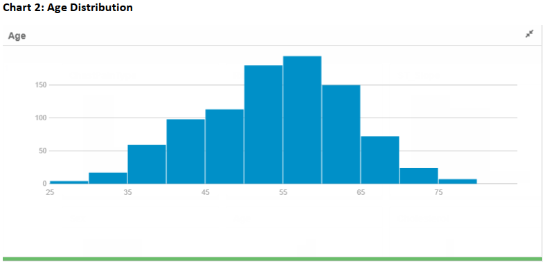  | 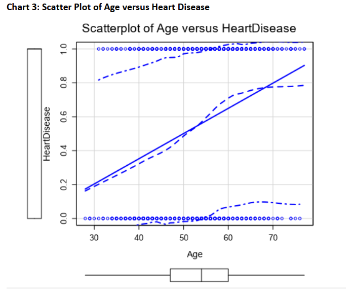 |

From the Age charts, we can see that the age feature is quite spread out as the age of patients ranges from twenty-five years to seventy-five years. This will be beneficial in helping the model predict for different age groups.
### ChestPainType
|                                  |                                       |
|:--------------------------------:|:-----------------------------------:  |
|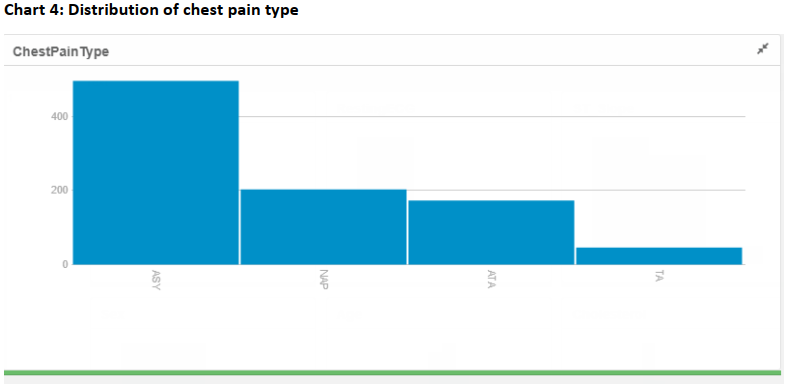      |  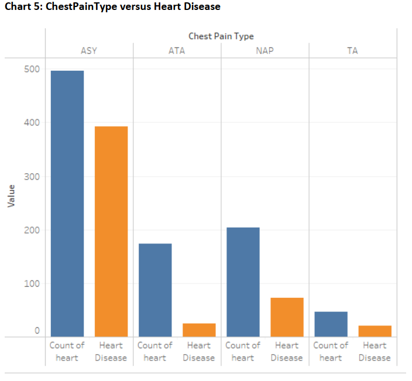        |

Patients with Asymptomatic chest pain type are the most likely to develop heart disease with a heart disease rate of about seventy-nine percent. This is followed by TA chest pain type with a heart disease rate of about forty-three percent, ATA chest pain type with a heart disease rate of about forty-two percent, and NAP has the lowest rate of heart disease at about twelve percent.
### Cholestrol
|                                  |                                       |
|:--------------------------------:|:-----------------------------------:  |
|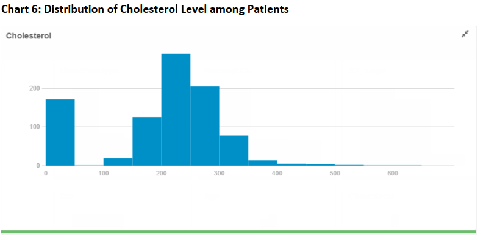        |  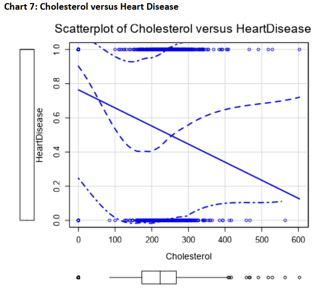           |

According to Beckerman (2020), Cholesterol level is an indicator of the likelihood to develop a heart disease. A total blood cholesterol level of 240mg/dL and above is considered high risk, 200-239 mg/dL is borderline high risk, and less than 200 mg/dL is desirable. More than sixty percent of patients have a cholesterol level that falls within borderline high risk and high risk.  

The scatterplot in chart 7 above showed that people with a cholesterol of 300mgdl are more prevalent among patients with heart failure. It is important to note that there are outliers such as patients with cholesterol level above 400mg/dl among patients with and without heart disease. Therefore, the cholesterol variable by itself is not enough to predict the likely hood of getting a heart disease. It is however still an important factor to consider
### MaxHR
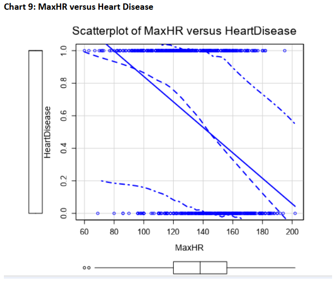  

The maximum heart rate ranges from sixty (60) to two hundred and ten (210). According to NHS, most adults have a resting heart rate between 60 and 100bpm. Heart rate also varies by fitness level, people who are fit such as athletes would have lower heart rate usually between 40 to 60bpm (NHS, 2021). According to the Framingham study, there is a higher risk in clinical outcomes for patients withincreased heart rate in the general population and in patients with heart failure. The study further explained that in patient with heart failure, resting heart rate of more than 80bpm could cause myocardial dysfunction which further deteriorates heart failure (Hori & Hiroshi, 2012).

In the Chart 9 scatter plot, it is interesting to see that some patients with low and normal heart rate have heart disease while some patients with high heart rate do not have heart disease. Therefore, MaxHR variable by itself is not enough to predict the likely hood of getting a heart disease.
### Oldpeak
|                                  |                                       |
|:--------------------------------:|:-----------------------------------:  |
|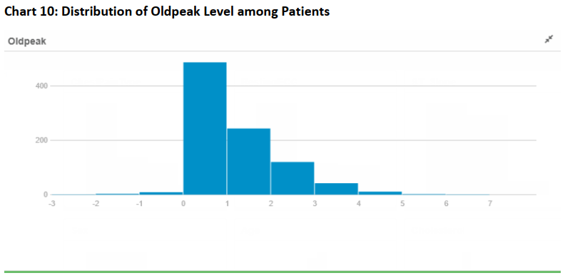          |  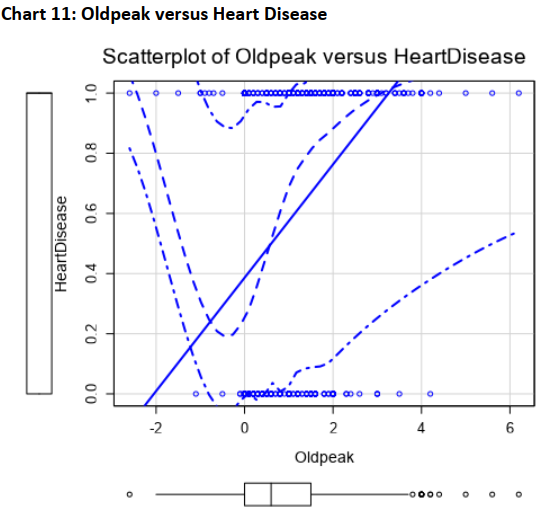             |

In the chart 11 scatterplot above, oldpeak greater than two is more prevalent in patients with
heart disease.
### RestingBP
|                                  |                                       |
|:--------------------------------:|:-----------------------------------:  |
|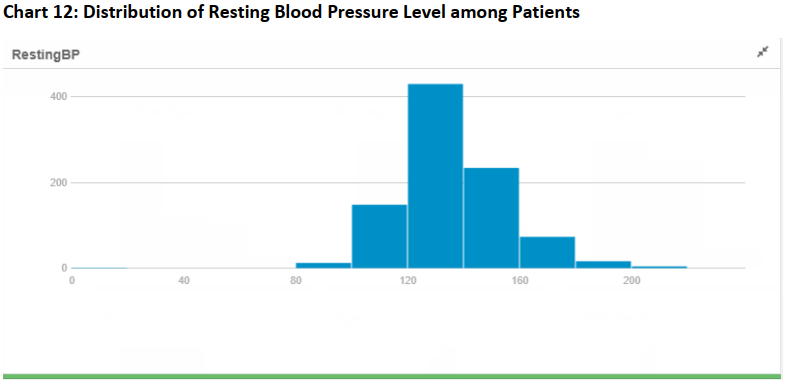        |  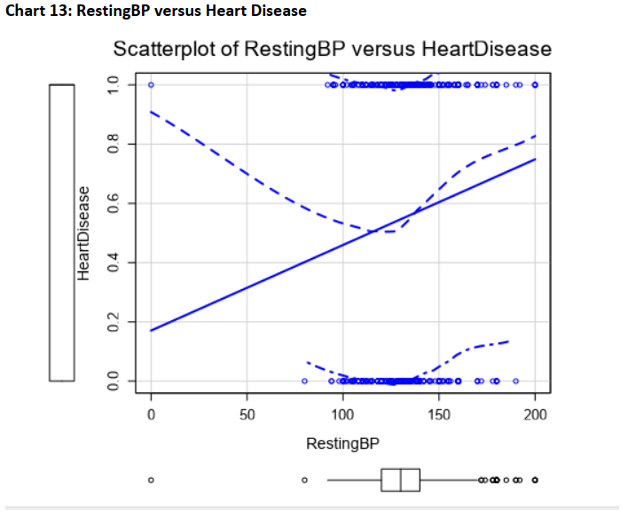           |

According to the British Heart Foundation, systolic blood pressure between 140 and 180mmHg signifies a possible hypertension, blood pressure above 180mmHg is severe hypertension (British Heart Foundation, 2021). In the scatterplot above, resting blood pressure above 140 is more prevalent in patients with heart disease, however, there are quite a number of patients with high blood pressure without heart disease.
### RestingECG
|                                  |                                       |
|:--------------------------------:|:-----------------------------------:  |
|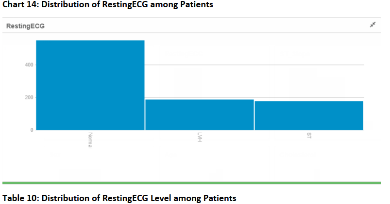              |  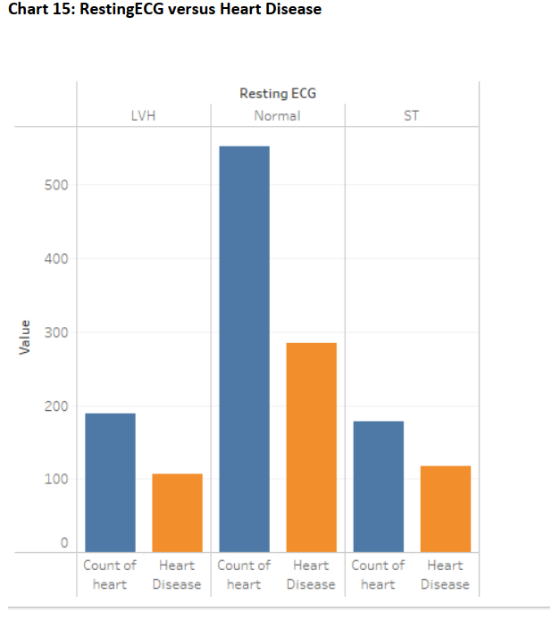          |

The resting electrocardiogram results of about sixty percent of the patients is normal, while about twenty percent is LVH and about nineteen percent electrocardiogram result is ST.  

Patients with electrocardiogram results that having ST-T wave abnormality (T wave inversions and/or ST elevation or depression of > 0.05 mV) are more likely to heart disease than those who have LVH and normal resting ECG.
### Sex 
|                                  |                                       |
|:--------------------------------:|:-----------------------------------:  |
|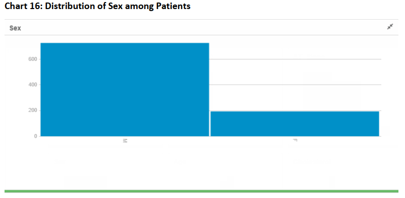              |  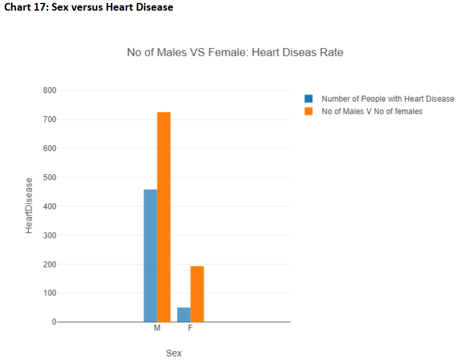                 |

The patients in the dataset are predominantly male, making up about seventy-nine percent of the dataset. This might mean that the model might be better at predicting heart disease for men than for women. There is however, a higher rate of heart disease among men with about sixty-three percent of the male patients having heart disease compared to about twenty-fivepercent of the women. A study in Norway which included thirty-four thousand (34,000) people (about half of whom were women) who had a heart attack between 1979 and 2012 found that throughout life, men were about twice as likely as women to have a heart attack (Harvard Health, 2016).
### ST_Slope
|                                  |                                       |
|:--------------------------------:|:-----------------------------------:  |
|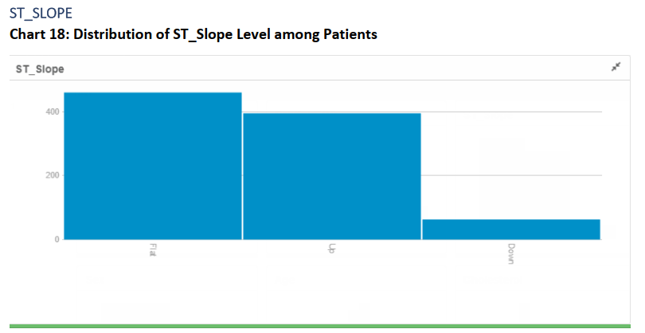          |  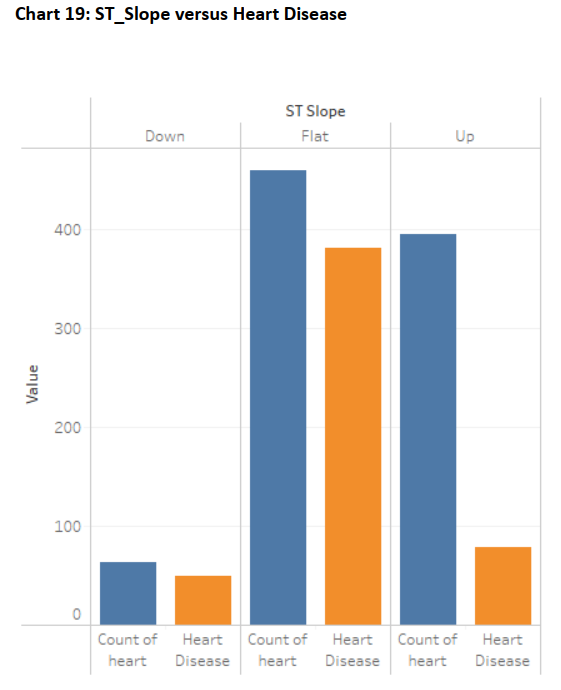             |

The slope of the peak exercise ST segment varies among the patients. There is a higher rate (eighty-two percent) of heart disease among patients whose ST slope is flat, compared to about seventy eight percent among those whose ST_Slope is down and about twenty percent among patients whose ST_slope is up.
### ExerciseAngina
|                                  |                                       |
|:--------------------------------:|:-----------------------------------:  |
|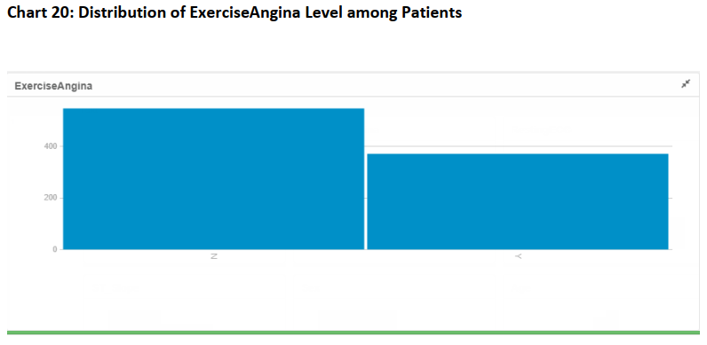   |  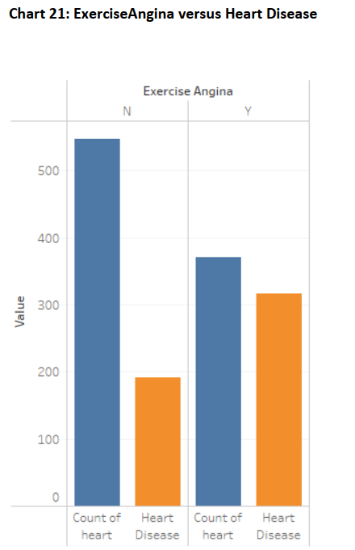                     |

The rate of people with heart disease among those who were a ‘Yes’ for exercise angina is eighty-five percent, as compared to thirty-five percent of those who were a ‘No’.
### FastingBS
|                                  |                                       |
|:--------------------------------:|:-----------------------------------:  |
|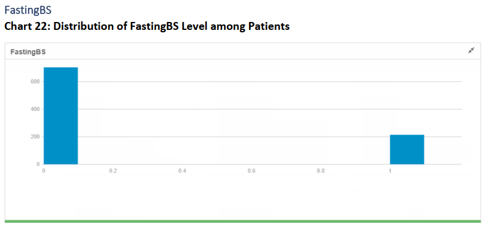   |  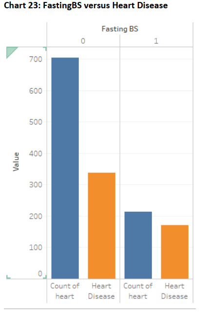                 |

The rate of people with heart disease among those who were 1 for fasting blood sugar is eightyfive percent, as compared to forty-eight percent of those who were 0. A cross-sectional study of nearly two thousand five hundred (2500) people showed that fasting blood sugar of above 100mg/dl increases risk of heart disease by three hundred percent. (American Journal Cardiology, 2002).  

### Preparation for Modelling
I am now going to ensure that the data is in good condition for modelling. I am going to change ExerciseAngina from ‘Y’ and ‘N’ which stands for ‘Yes’ and ‘No’ to 0 and 1.  

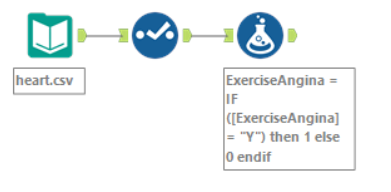  

The values of ExerciseAngina have been changed to numeric variables, therefore, I will use the select too to change its datatype to integer.  

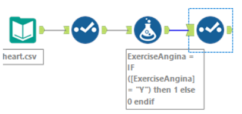   

Now we can begin to build the model.
## Data Modelling
The first step in this stage is to split the data between training and testing data. In this case, I would be using eighty percent of the dataset for training and twenty percent for testing. This will be done using the create sample tool.  

  

Now we will add the models we want to use which are logistic regression and forest model. For each of the model, we will select the predictor variables and target variables. In this case, my target variable is heart disease and the remaining fields are my predictor variables. Note that the logistic regression requires the target variable be set to string.  

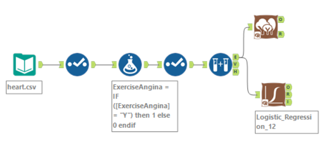  

I will join the two models with the union tool to enable me compare the algorithms of the two models.  

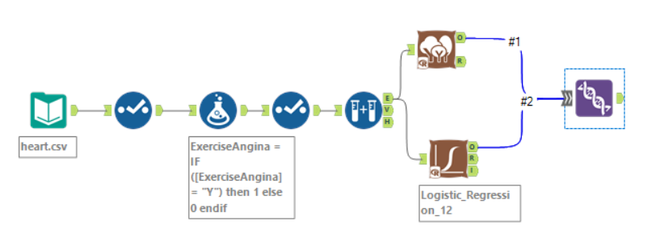  

The next step is to use the model comparison tool to compare the outcomes of the two algorithms. The union of the two models and the testing data will be connected to the model comparison tool. Using the testing data will allow me to judge the model’s performance on unseen data.  

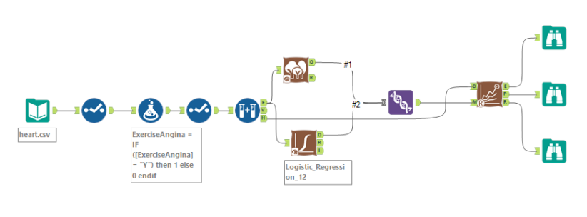  

## Evaluation
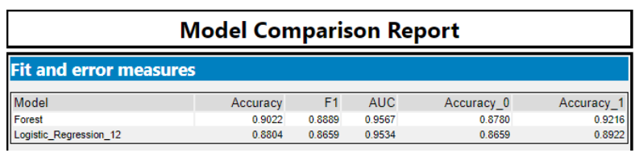  

The two models used have satisfied our condition during the business understanding phase that the model will be deemed successful if it has an accuracy above eighty percent. The forest model has an accuracy of ninety percent against the test data while the logistic regression which has an accuracy of eighty-eight percent.
### Confusion Matrix of Forest Model
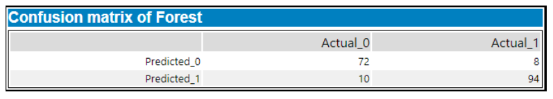  

The confusion matrix of the forex model shows the breakdown of predictions made by theforest model. It is a table of the predicted values of the forest model against the actual values. The forest model made seventy-two predictions correctly and ten wrong predictions for patients without heart disease, while making ninety-four correct predictions and eight wrong predictions for patients with heart disease
### Confusion Matrix of Logistic Regression
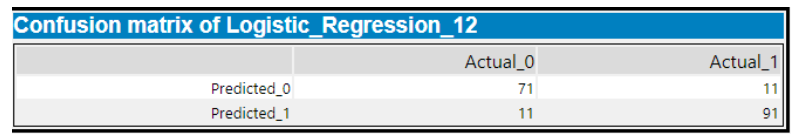  

The confusion matrix of the logistic regression model shows the breakdown of predictions made by the logistic regression model. It is a table of the predicted values of the logistic regression model against the actual values. The model made seventy-one predictions correctly and eleven wrong predictions for patients without heart disease, while making ninety-one correct predictions and eleven wrong predictions for patients with heart disease.
## Deployment and Conclusion
The model created will be deployed by integrating heart disease prediction model where it can take input and return an output. This model is best applicable in the healthcare industry such as hospital where patients’ data can be inputted into the model to determine their likelihood of having a heart condition.  
When it is determined that someone is likely to have a heart disease after examining certain factors, it is then easier to take preventive measures through lifestyle changes such as eating healthy, engaging in physical activity, reducing alcohol consumption, and not smoking among others (NHS, 2021).

